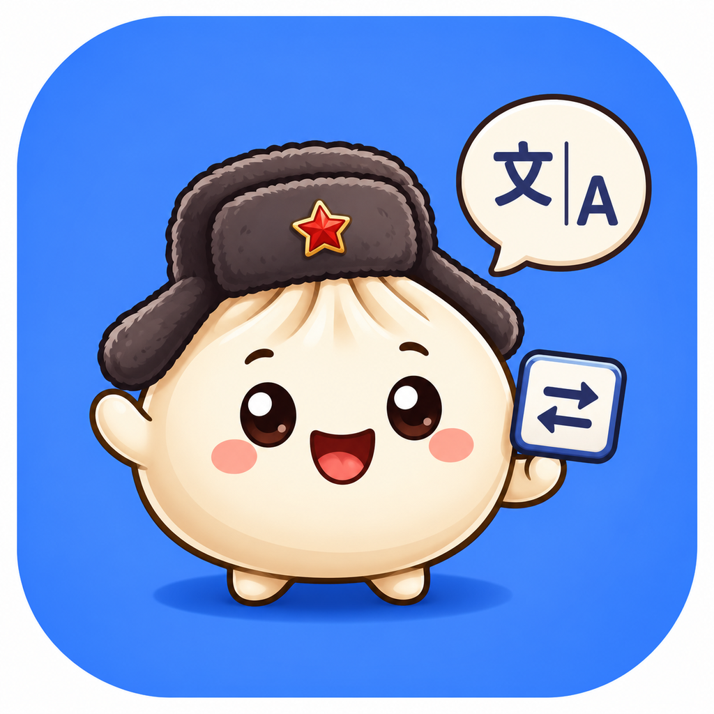
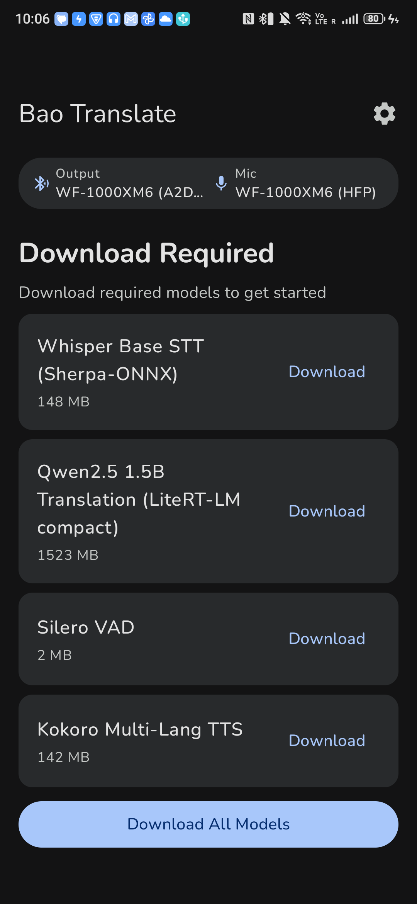
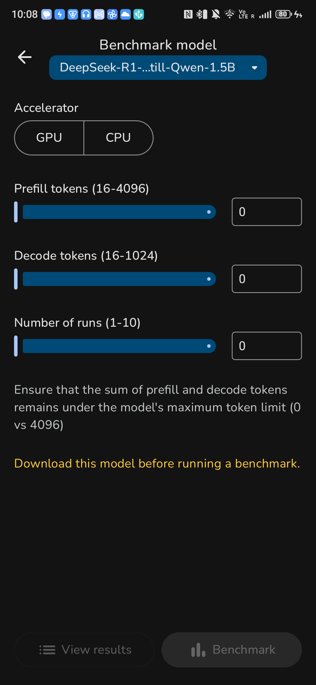

<p align="center">
  
</p>

<h1 align="center">Bao Translate</h1>

<p align="center"><strong>Hear anyone, in your language, in your own voice — live and fully offline.</strong></p>

<p align="center">
  <a href="LICENSE"></a>
  
  
  
  <a href="https://ai.google.dev/edge"></a>
  <a href="https://github.com/d4551/bao-translate/releases"></a>
</p>

---

## In one sentence (ELI5)

You talk, the other person talks, and the phone instantly says each side's words out loud in the
other person's language — and if you record a short sample of your voice once, your translations
come out **sounding like you**. No internet, no accounts, nothing leaves the phone.

## Why it's different

* **It speaks in _your_ voice.** Enroll your voice once; translations into any supported language are
  spoken in your own timbre — cross-lingual voice cloning that runs entirely on the phone.
* **It's genuinely offline.** Voice detection, speech-to-text, translation, and speech all run as
  local models. Airplane mode works. Nothing is uploaded.
* **It's a real conversation, not a walkie-talkie.** Two phones pair over Bluetooth LE; each person
  speaks their own language and hears the other in theirs, attributed by speaker.

## How it works

A fully local pipeline turns each utterance into translated speech. The speaker's language is
recognized, translated, and re-spoken — as a preset voice, your cloned voice, or a device voice for
languages without a preset. In **Conversation mode** each translated turn is also relayed to a
paired phone and spoken there.

```
                                   ┌─ Kokoro preset voice (8 languages)
mic ─▶ VAD ─▶ STT ─▶ Translation ─┼─ YOUR cloned voice (OpenVoice timbre transfer, any language)  ─▶ speaker
      Silero  Whisper  Qwen2.5-1.5B └─ Device TTS fallback (de/ko/ru/ar/…)                          └─▶ BLE peer ─▶ speaker
              (forced to the         (LiteRT-LM)
               selected language)
```

* **STT** uses the **selected source language** (not blind auto-detect) so recognition stays
  accurate across languages; Auto-detect remains available.
* **Voice cloning** = Kokoro produces correct pronunciation in the target language, then the
  **OpenVoice** tone-color converter re-times it into your enrolled timbre — so cloning works for
  every language Kokoro can pronounce, not just English.

## Supported languages

English · Spanish · French · German · Italian · Portuguese · Russian · Chinese · Japanese · Korean · Arabic

Spoken output uses Kokoro for **en/es/fr/it/pt/zh/ja** (+ Hindi), and automatically falls back to the
device's own text-to-speech for languages Kokoro can't voice (**de/ko/ru/ar**), so every supported
language is both translated and spoken.

## Screenshots

<p align="center">
  
  &nbsp;&nbsp;
  
</p>

<p align="center"><em>Left: translation home with the on-device model stack and Bluetooth audio routing. Right: on-device model benchmarking.</em></p>

## ✨ Features

* **Real-time speech translation** — a complete on-device VAD → STT → translation → TTS pipeline.
* **Cross-lingual voice cloning** — enroll once; hear translations in **your own voice** in any
  supported language, computed on-device (no voice data leaves the phone).
* **Live Conversation mode** — multi-speaker: translated turns sync to a peer device over Bluetooth
  LE and play aloud on both ends, attributed per speaker.
* **Per-speaker language selection** — pick each side's source/target language; STT re-configures to
  the chosen language for accurate recognition.
* **100% on-device & private** — all inference runs on your hardware; no internet, nothing uploaded.
* **Bluetooth audio routing** — choose headset mic and output devices in-app.
* **Model management & benchmarking** — download curated models (resumable, integrity-checked), load
  your own, and benchmark on GPU/CPU with configurable prefill/decode tokens.
* **On-device LLM toolset** (from the AI Edge Gallery foundation) — alongside translation, the app
  bundles upstream local-LLM tools that run models you download in-app: **AI Chat** (multi-turn),
  **Prompt Lab** (single-turn prompting), **Ask Image** (vision Q&A), **Audio Scribe** (audio
  understanding), and **Agent Skills** — tool use, [**MCP server**](mcp/) integration, and
  [**function calling**](Function_Calling_Guide.md). Plus the experimental **Mobile Actions** and
  **Tiny Garden**.

## On-device models

Downloaded in-app from Hugging Face on first run:

| Role | Model | Size |
| --- | --- | --- |
| Voice activity detection | Silero VAD | 2 MB |
| Speech-to-text | Whisper Base (sherpa-onnx) | 148 MB |
| Translation | Qwen2.5 1.5B (LiteRT-LM) — Gemma optional | 1.5 GB |
| Text-to-speech | Kokoro Multi-Lang | 142 MB |
| Voice cloning | OpenVoice tone converter + reference encoder (ONNX) | 131 MB |

Spoken output for the fallback languages uses the platform text-to-speech already on your phone (no
download).

## 🏁 Getting started

**Requirements:** Android 12 (API 31) or newer.

1. Install the latest APK from [**Releases**](https://github.com/d4551/bao-translate/releases), or build from source (below).
2. On first launch, tap **Download All Models** (or download individually) to fetch the on-device stack.
3. (Optional) **Enroll your voice** in settings to have translations spoken in your own voice.
4. Open **Conversation mode**, pick each speaker's language and audio devices, and start translating.

## 🛠️ Build from source

Standard Gradle Android project rooted at [`Android/src`](Android/src).

```bash
cd Android/src

# Use Android Studio's bundled JBR (JDK 21) — matches Gradle 8.10.2 / AGP 8.8.2
export JAVA_HOME="/Applications/Android Studio.app/Contents/jbr/Contents/Home"
export PATH="$HOME/Library/Android/sdk/platform-tools:$PATH"

./gradlew :app:assembleDebug              # compile + build the debug APK
./gradlew :app:testDebugUnitTest          # unit tests
./gradlew :app:connectedDebugAndroidTest  # on-device E2E (translation, live-mic, cloning, every language)

adb install -r app/build/outputs/apk/debug/app-debug.apk
```

* SDK: `compileSdk = 35`, `minSdk = 31`; `applicationId = com.bao.translate`.
* `app/libs/` holds the vendored `sherpa-onnx` AAR; it and `onnxruntime-android` both ship
  `libonnxruntime.so` (the same ORT 1.24.3 build), de-duplicated at packaging via `jniLibs.pickFirsts`.
* See [DEVELOPMENT.md](DEVELOPMENT.md) for more.

## 📁 Project structure

| Path | What |
| --- | --- |
| [`Android/`](Android/) | The Android app (Gradle project under `Android/src`) |
| [`bao-translate/`](bao-translate/) | Brand assets and app-icon sets |
| [`mcp/`](mcp/) | Model Context Protocol server integration and docs |
| [`skills/`](skills/) | Agent skill packs |
| [`model_allowlists/`](model_allowlists/), [`model_allowlist.json`](model_allowlist.json) | Curated model allowlist |
| [`docs/`](docs/) | Screenshots and documentation |

## 🧩 Built on

Bao Translate stands on excellent open-source work — thank you to:

* [**Google AI Edge Gallery**](https://github.com/google-ai-edge/gallery) — the app foundation (Apache-2.0)
* [**LiteRT** / **LiteRT-LM**](https://github.com/google-ai-edge/LiteRT-LM) — on-device model runtime
* [**sherpa-onnx**](https://github.com/k2-fsa/sherpa-onnx) — on-device STT/TTS engine
* [**ONNX Runtime**](https://github.com/microsoft/onnxruntime) — runs the on-device voice-cloning graphs
* [**Whisper**](https://github.com/openai/whisper) — speech recognition
* [**Qwen2.5**](https://github.com/QwenLM/Qwen2.5) — translation model
* [**Kokoro**](https://huggingface.co/hexgrad/Kokoro-82M) — multilingual TTS
* [**OpenVoice**](https://github.com/myshell-ai/OpenVoice) — cross-lingual tone-color (voice) conversion
* [**Silero VAD**](https://github.com/snakers4/silero-vad) — voice activity detection
* [**Hugging Face**](https://huggingface.co/litert-community) — model hosting

## 🤝 Feedback & contributing

* 🐞 **Found a bug?** [Report it](https://github.com/d4551/bao-translate/issues/new?template=bug_report.md) (see also the [Bug Reporting Guide](Bug_Reporting_Guide.md)).
* 💡 **Have an idea?** [Suggest a feature](https://github.com/d4551/bao-translate/issues/new?template=feature_request.md).
* See [CONTRIBUTING.md](CONTRIBUTING.md) before opening a pull request.

## 📄 License

Licensed under the Apache License, Version 2.0. See [LICENSE](LICENSE). Bao Translate is a derivative of Google AI Edge Gallery; upstream copyright and the Apache-2.0 license are retained.
