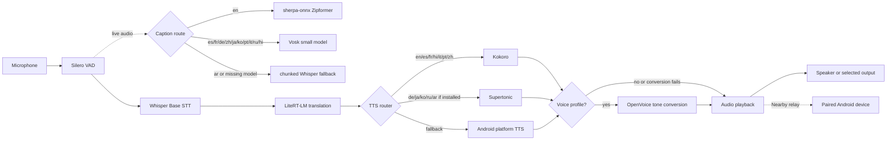
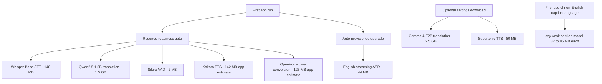
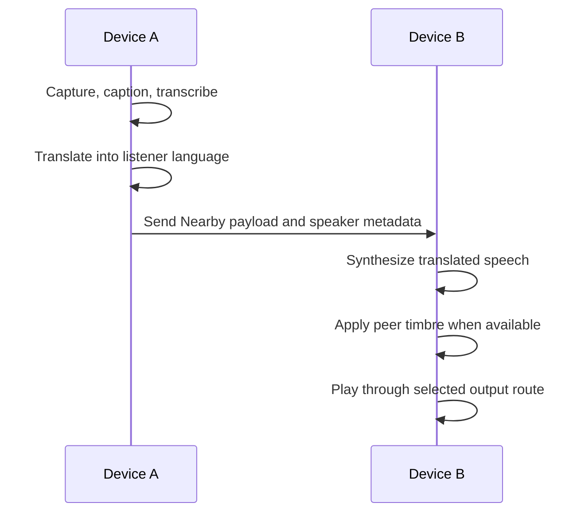
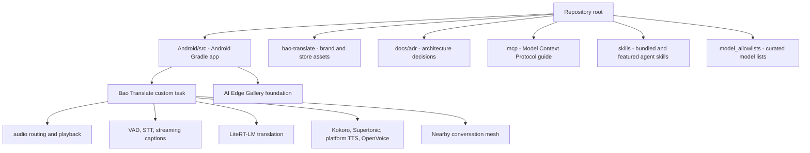

<p align="center">
  
</p>

<h1 align="center">Bao Translate</h1>

<p align="center"><strong>Private, on-device live speech translation with local voice cloning.</strong></p>

<p align="center">
  <a href="LICENSE"></a>
  
  
  
  
</p>

## ELI5

Bao Translate is a tiny interpreter that runs on your Android phone. You speak, it captions and translates the words, then it speaks the translation out loud. If you enroll a short local voice profile, translated speech can be converted toward your timbre. After the model stack is downloaded, conversation audio and voice profiles stay on the device.

## What It Does

- **Live speech translation:** microphone audio flows through local VAD, STT, translation, TTS, and playback.
- **Streaming captions:** English uses a sherpa-onnx Zipformer transducer; 10 other languages use lazy Vosk caption models; Arabic falls back to chunked Whisper captions.
- **On-device translation:** Qwen2.5 1.5B is the required LiteRT-LM translation model; Gemma 4 E2B is an optional upgrade.
- **On-device speech:** Kokoro handles en/es/fr/hi/it/pt/zh; optional Supertonic handles de/ja/ko/ru/ar; Android platform TTS is the fallback when a supplemental voice is unavailable.
- **Voice cloning:** OpenVoice ONNX tone conversion is provisioned with the required stack and is applied when a local or peer voice profile is available.
- **Conversation modes:** face-to-face use, continuous translation, per-speaker language selection, Bluetooth audio routing, and Nearby Connections relay between Android devices.
- **Model management:** downloads are curated, status-tracked, resumable, integrity-checked, and visible in the app.

## How It Works



The live caption path is optimized for responsiveness while Whisper provides the final transcript used for translation. The TTS router chooses the best local speech engine for the target language, then OpenVoice can convert the synthesized audio toward the enrolled speaker timbre.

## Model Provisioning



Required models must be ready before the core translation loop is considered ready. The English streaming caption model is auto-provisioned but does not block the required readiness gate. Vosk caption models are downloaded only when a language needs them.

## Conversation Relay



Nearby Connections is used for the two-device mesh. Each side can keep its own source and target language, and peer timbre metadata lets the receiving device speak the translation in the other speaker's voice profile when available.

## Supported Languages

English, Spanish, French, German, Chinese, Japanese, Korean, Portuguese, Italian, Russian, Arabic, and Hindi.

| Capability | Coverage |
| --- | --- |
| Translation targets | All 12 selectable languages |
| Source language | Manual selection or Auto detect |
| Live captions | English via sherpa-onnx Zipformer; es/fr/de/zh/ja/ko/pt/it/ru/hi via Vosk; Arabic via chunked Whisper fallback |
| Local speech | Kokoro for en/es/fr/hi/it/pt/zh; Supertonic for de/ja/ko/ru/ar when installed; Android platform TTS fallback |
| Voice conversion | OpenVoice tone conversion for enrolled local and peer voice profiles |

## Model Stack

Models are downloaded in-app from curated sources on first use or from settings.

| Role | Model | Provisioning |
| --- | --- | --- |
| Voice activity detection | Silero VAD | Required |
| Speech-to-text | Whisper Base through sherpa-onnx | Required |
| Streaming captions, English | sherpa-onnx Zipformer transducer | Auto-provisioned |
| Streaming captions, 10 languages | Vosk small models | Lazy per language |
| Translation | Qwen2.5 1.5B through LiteRT-LM | Required |
| Translation upgrade | Gemma 4 E2B through LiteRT-LM | Optional |
| Text-to-speech | Kokoro Multi-Lang | Required |
| Supplemental TTS | Supertonic TTS through sherpa-onnx | Optional |
| Fallback TTS | Android TextToSpeech engine | Device-provided |
| Voice conversion | OpenVoice tone converter and reference encoder through ONNX Runtime | Required |

## Getting Started

Requirements:

- Android 12 / API 31 or newer.
- Enough local storage for the selected model stack.
- Network access for initial model downloads.
- Optional Bluetooth headset or second Android device for advanced conversation testing.

Steps:

1. Install an APK you have access to, or build from source.
2. Launch the app and download the required models.
3. Optional: enroll your voice in settings.
4. Choose source and target languages, pick audio devices if needed, and start translating.

Source builds that need in-app model downloads also need the Hugging Face OAuth client and redirect scheme described in [DEVELOPMENT.md](DEVELOPMENT.md).

## Build From Source

The Android Gradle project is rooted at [Android/src](Android/src).

```bash
cd Android/src

./gradlew :app:assembleDebug
./gradlew :app:testDebugUnitTest
./gradlew :app:connectedDebugAndroidTest
./gradlew :app:smokeE2e

adb install -r app/build/outputs/apk/debug/app-debug.apk
```

Build notes:

- `applicationId = com.bao.translate`.
- `versionName = 1.0.15`; `versionCode = 33`.
- `compileSdk = 37`; `minSdk = 31`; `targetSdk = 35`.
- The wrapper uses Gradle 9.5.1 with AGP 9.2.1 and Kotlin 2.4.0.
- Gradle toolchains use JDK 26 for compilation and emit Java 17 bytecode.
- The vendored `sherpa-onnx` AAR lives under `Android/src/app/libs/`.
- `sherpa-onnx` and `onnxruntime-android` both ship `libonnxruntime.so`; packaging keeps one shared object with `jniLibs.pickFirsts`.

See [DEVELOPMENT.md](DEVELOPMENT.md) for local setup, Hugging Face OAuth configuration, and verification notes.

## Repository Map



| Path | Purpose |
| --- | --- |
| [Android/](Android/) | Android application docs and Gradle project |
| [Android/src](Android/src) | App source, Gradle wrapper, tests, and resources |
| [bao-translate/](bao-translate/) | Brand assets and app icon resources |
| [docs/](docs/) | Architecture decisions and supporting documentation |
| [mcp/](mcp/) | Model Context Protocol integration guide |
| [skills/](skills/) | Agent skill documentation and examples |
| [model_allowlists/](model_allowlists/) and [model_allowlist.json](model_allowlist.json) | Curated model allowlists |
| [Function_Calling_Guide.md](Function_Calling_Guide.md) | Guide for adding custom mobile actions |
| [Bug_Reporting_Guide.md](Bug_Reporting_Guide.md) | Android bug report capture guide |

## Documentation

- [Android app guide](Android/README.md)
- [Development setup](DEVELOPMENT.md)
- [Contribution policy](CONTRIBUTING.md)
- [Bug reporting](Bug_Reporting_Guide.md)
- [Function calling](Function_Calling_Guide.md)
- [MCP integration](mcp/README.md)
- [Agent skills](skills/README.md)
- [Model allowlists](model_allowlists/README.md)

## Quality And Verification

Recommended local gates before shipping Android changes:

```bash
cd Android/src
./gradlew :app:verifyReleaseReady
./gradlew :app:smokeE2e
./gradlew :app:connectedDebugAndroidTest
```

Use a physical device for full translation, microphone capture, Bluetooth audio routing, voice cloning, and Nearby conversation validation. Emulator coverage is useful for compile, unit, and focused UI checks, but it does not replace hardware verification for the audio pipeline.

## Built On

Bao Translate builds on these open-source projects:

- [Google AI Edge Gallery](https://github.com/google-ai-edge/gallery) for the app foundation.
- [LiteRT and LiteRT-LM](https://github.com/google-ai-edge/LiteRT-LM) for local model execution.
- [sherpa-onnx](https://github.com/k2-fsa/sherpa-onnx) for on-device STT, streaming ASR, and TTS.
- [Vosk](https://github.com/alphacep/vosk-api) for multilingual streaming recognition.
- [ONNX Runtime](https://github.com/microsoft/onnxruntime) for voice-conversion graphs.
- [Whisper](https://github.com/openai/whisper) for speech recognition.
- [Qwen2.5](https://github.com/QwenLM/Qwen2.5) for required translation.
- [Gemma](https://ai.google.dev/gemma) for optional translation.
- [Kokoro](https://huggingface.co/hexgrad/Kokoro-82M) for multilingual TTS.
- [OpenVoice](https://github.com/myshell-ai/OpenVoice) for cross-lingual tone-color conversion.
- [Silero VAD](https://github.com/snakers4/silero-vad) for voice activity detection.
- [Hugging Face](https://huggingface.co/litert-community) for LiteRT-LM model hosting.

## Support And Contributing

- Found a bug? Use the local [bug report template](.github/ISSUE_TEMPLATE/bug_report.md) and include the details from the [Bug Reporting Guide](Bug_Reporting_Guide.md).
- Have an idea? Use the local [feature request template](.github/ISSUE_TEMPLATE/feature_request.md).
- Planning a code change? Read [CONTRIBUTING.md](CONTRIBUTING.md) first so expectations are clear.

## License

Bao Translate is licensed under the Apache License, Version 2.0. See [LICENSE](LICENSE). This project is derived from Google AI Edge Gallery; upstream copyright notices and Apache-2.0 licensing are retained.
