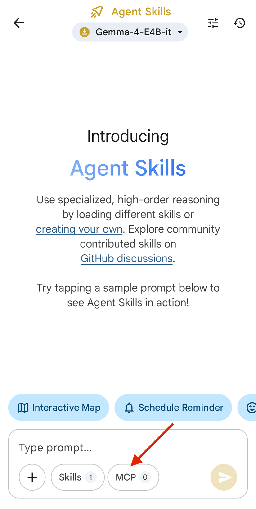
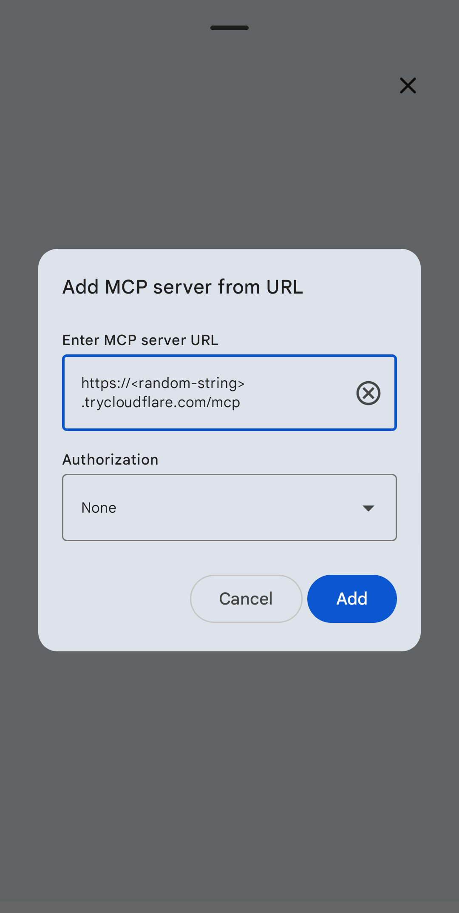
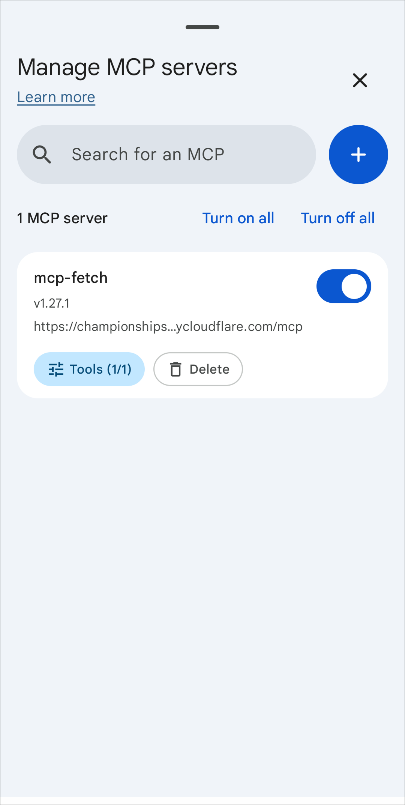
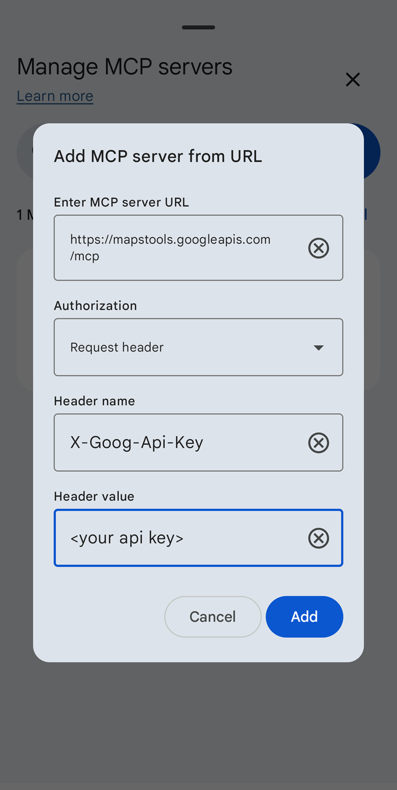

# Model Context Protocol In Bao Translate

Bao Translate includes experimental Model Context Protocol (MCP) support through the Agent Skills and on-device LLM tooling inherited from AI Edge Gallery. MCP lets a local model discover tools from configured servers, decide when to call them, and receive structured results back inside the chat flow.

> [!IMPORTANT]
> MCP support is experimental. Keep only the tools you need enabled, review server permissions carefully, and avoid sending private information to servers you do not control.

## How MCP Works In The App

- **Tool discovery:** The app connects to configured MCP servers and loads their tool schemas.
- **Prompt injection:** Tool names, descriptions, and schemas are added to the model context.
- **User-controlled execution:** When the model requests a tool call, the app routes it to the selected MCP server and applies the configured permission rules.
- **Result handling:** Tool responses return to the model so it can continue the conversation.

## Add A Local MCP Server

This example connects the official [`fetch`](https://github.com/modelcontextprotocol/servers/tree/main/src/fetch) server. Most desktop MCP servers use `stdio`; a mobile app needs a network-reachable HTTP endpoint, so this flow uses [`supergateway`](https://github.com/supercorp-ai/supergateway) to expose the server over Streamable HTTP.

### 1. Start The Server

Install the fetch server and run it through Supergateway:

```bash
python3 -m venv venv
source venv/bin/activate
pip install mcp-server-fetch

npx -y supergateway --stdio 'mcp-server-fetch' --outputTransport streamableHttp
```

The server listens at:

```text
http://localhost:8000/mcp
```

### 2. Expose The Server To The Device

If the Android device cannot reach your host machine directly, expose the port with a tunnel. Cloudflare Quick Tunnels are one option:

```bash
cloudflared tunnel --url http://localhost:8000
```

Use the generated HTTPS URL and append `/mcp`.

### 3. Add The Server In The App

1. Open **Agent Chat**.
2. Choose a capable model. Larger local models generally handle tool schemas more reliably.
3. Tap **MCP** under the message input.
4. Tap **Add MCP Server**.
5. Enter the server URL, including `/mcp`.
6. Confirm that the app discovers the server tools.





### 4. Try A Prompt

Examples:

- Fetch `https://play.google.com/store/apps/details?id=com.google.ai.edge.gallery` and summarize the app features.
- Fetch a public documentation page and list the key setup steps.

> [!WARNING]
> Review the [`fetch` server documentation](https://github.com/modelcontextprotocol/servers/blob/main/src/fetch/README.md). Fetching arbitrary URLs can expose browsing intent and retrieved content to the MCP server.

## Add A Cloud MCP Server

Cloud-hosted MCP servers are already network-accessible and usually require authentication. Bao Translate can attach custom headers to MCP requests.

This example connects the Maps Grounding Lite MCP endpoint:

```text
https://mapstools.googleapis.com/mcp
```

### 1. Create Credentials

Follow the [Maps Grounding Lite setup guide](https://developers.google.com/maps/ai/grounding-lite) and create an API key or credential appropriate for the service.

### 2. Add Custom Headers

1. Open **Agent Chat**.
2. Tap **MCP**.
3. Tap **Add MCP Server**.
4. Enter the server URL.
5. Add the required authentication header.

Example:

| Field | Value |
| --- | --- |
| Server URL | `https://mapstools.googleapis.com/mcp` |
| Header name | `X-Goog-Api-Key` |
| Header value | Your API key |



### 3. Try A Prompt

Examples:

- Use `compute_routes` to calculate a route from San Francisco to San Jose.
- Use `search_places` to recommend highly rated ramen restaurants in downtown Mountain View, CA.

## Limitations

- **Model reliability:** Tool calling requires the model to read and follow schemas. Larger, higher-quality local models are more reliable than small models.
- **Context size:** Tool descriptions consume context. Enable only the tools needed for the current task.
- **Numeric precision:** Some GPU-accelerated local inference paths can produce imperfect numeric formatting. Verify coordinates, totals, and other high-precision outputs.
- **Privacy boundary:** MCP servers may be remote services. Treat every enabled server as a separate trust boundary.

## Safety Checklist

- Enable only the server and tools required for the current workflow.
- Review tool descriptions before granting broad permissions.
- Avoid sending secrets, personal data, private locations, or sensitive documents to untrusted servers.
- Prefer local servers for private workflows.
- Rotate credentials if they were entered on a shared device.
